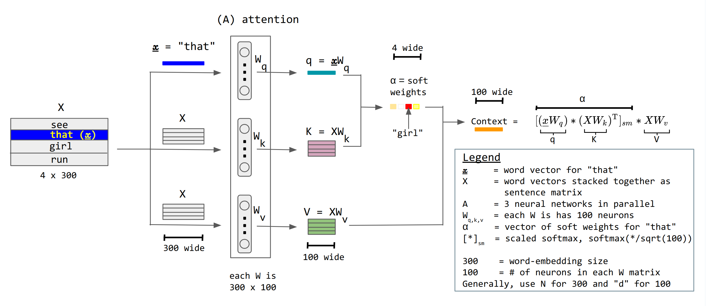

# Machine Learning Basics - Set 2: Sorting with RNNs and Self-Attention

**Objective:** In this exercise, you will tackle a sequence-to-sequence problem: sorting a list of numbers. You will build and compare two different neural network architectures: a Recurrent Neural Network (RNN) as a baseline, and a more powerful model using a **Self-Attention** mechanism.

**Tools**: You can use your preferred programming language (e.g., Python with NumPy/SciPy, MATLAB, Julia). You will need basic array/matrix operations, random number generation (standard normal), and math functions (exp, log, sum, mean). No dedicated ML frameworks are required. In the following pseudocode for Python/Pytorch is provided.

**The Problem:** We will generate sequences of unique integers (e.g., `[15, 3, 28, 9]`) and train a model to output the sorted version of that sequence (e.g., `[3, 9, 15, 28]`).

### Why is this an interesting challenge?

This task requires understanding the relationships between *all* elements in a sequence. To decide that `3` should be the first number in the output, the model needs to compare it with `15`, `28`, and `9`.

*   **RNNs** process sequences step-by-step, passing information along in a hidden state. For sorting, this means the hidden state must act as a memory, compressing information about all numbers seen so far. This can become a "bottleneck," especially for long sequences, making it hard to capture these long-range dependencies.

*   **Self-Attention** allows every element in the input sequence to directly look at and compare itself with every other element. This ability to make global comparisons in a single step makes it exceptionally well-suited for tasks like sorting.

We expect the Self-Attention model to significantly outperform the RNN, and this exercise will demonstrate why.

## 1. The Sorting Problem and Dataset

First, let's create a function to generate our data. For each batch, it will create random sequences of integers and their corresponding sorted versions, which will serve as our labels.

```python
import torch
import torch.nn as nn
import matplotlib.pyplot as plt

# We'll generate sequences with numbers from 0 up to max_val-1
max_val = 30

def generate_data(batch_size, seq_len, max_val):
    """
    Generates batches of unsorted sequences and their sorted counterparts.
    """
    # Generate random sequences of integers, drawing without replacement
    # to ensure unique values in each sequence.
    inputs = torch.empty((batch_size, seq_len), dtype=torch.int64)
    for i in range(batch_size):
        # torch.randperm(n) gives a random permutation of integers from 0 to n-1.
        inputs[i] = torch.randperm(max_val)[:seq_len]
    
    # Sort each sequence to get the target labels.
    labels = torch.sort(inputs, dim=1).values
    return inputs, labels

# Let's see an example
inputs, labels = generate_data(batch_size=2, seq_len=10, max_val=max_val)
print("Inputs:\n", inputs)
print("\nLabels (Sorted Inputs):\n", labels)
```

## 2. Approach 1: A Recurrent Neural Network (RNN) Baseline

Our first attempt will use a standard RNN architecture. We'll use a Gated Recurrent Unit (GRU), which is a popular type of RNN cell. The model will read the input sequence one number at a time and generate an output sequence.

### 2a) Building the RNN Sorter

Our RNN model will consist of three main parts:
1.  `nn.Embedding`: This layer converts each integer (e.g., `15`) into a dense vector representation. This is more effective than feeding raw numbers to the network.
2.  `nn.GRU`: This is the core recurrent layer that processes the sequence of vectors.
3.  `nn.Linear`: A final fully-connected layer that takes the RNN's output at each time step and maps it back to a score for each possible number in our vocabulary (`max_val`).

```python
class RnnSorter(nn.Module):
    def __init__(self, vocab_size, embedding_dim, hidden_dim):
        super().__init__()
        # Use an embedding layer to represent numbers as vectors
        self.embedding = nn.Embedding(vocab_size, embedding_dim)
        # The RNN encoder
        self.rnn = nn.GRU(embedding_dim, hidden_dim, batch_first=True)
        # A linear layer to map the output hidden states to our vocab
        self.fc = nn.Linear(hidden_dim, vocab_size)

    def forward(self, x):
        # x shape: [batch_size, seq_len]
        embedded = self.embedding(x)
        # embedded shape: [batch_size, seq_len, embedding_dim]
        
        # We pass the entire sequence of embeddings to the GRU.
        output, _ = self.rnn(embedded)
        # output shape: [batch_size, seq_len, hidden_dim]
        
        # We apply the linear layer to each time step's output.
        logits = self.fc(output)
        # logits shape: [batch_size, seq_len, vocab_size]
        return logits
```

### 2b) Training the RNN

The training loop is standard. We generate data, pass it through the model, compute the loss, and update the weights. We treat this as a classification problem for each position in the sequence: "What number should go in this slot?" This makes `CrossEntropyLoss` a suitable choice.

```python
# Model parameters
epochs = 100
batch_size = 32
embedding_dim = 16
hidden_dim = 32

# Instantiate the model, loss function, and optimizer
model_rnn = RnnSorter(vocab_size=max_val, embedding_dim=embedding_dim, hidden_dim=hidden_dim)
loss_fn_rnn = nn.CrossEntropyLoss()
optimizer_rnn = torch.optim.Adam(model_rnn.parameters(), lr=0.001)

print(f"Num of parameters in RNN model: {sum(p.numel() for p in model_rnn.parameters() if p.requires_grad)}")

print("\n--- Training RNN (for a few epochs to see loss) ---")
for epoch in range(epochs):
    optimizer_rnn.zero_grad()
    inputs, labels = generate_data(batch_size=batch_size, seq_len=10, max_val=max_val)
    
    # Forward pass
    outputs = model_rnn(inputs)
    
    # Loss function expects shape [N, C], so we reshape our outputs and labels
    # from [batch, seq_len, vocab] to [batch*seq_len, vocab]
    loss = loss_fn_rnn(outputs.view(-1, max_val), labels.view(-1))
    
    # Backward pass and optimization
    loss.backward()
    optimizer_rnn.step()
    
    if epoch % 10 == 0:
        print(f'Epoch {epoch}, Loss: {loss.item():.4f}')
```

## 3. Approach 2: Using Self-Attention

## 3. Approach 2: Using Self-Attention

Now, let's build a model using the self-attention mechanism, the core component of the Transformer architecture.
Attention and self-attention are very powerful transformations. In this section, we will write our own Attention layer.

The idea of attention was published in 2014 by A. Graves in "Neural Turing Machines". It was picked up again in 2017 by A. Vaswani et al in "Attention is all you need". This paper coined the term Transformer architecture which relies strongly on self-attention layers. This architecture proved very successful in the language processing domain. Today, all large language models rely on the attention mechanism, which is also spreading to most other domains (including science).

A super nice visualizer to help you grasp the idea of attention in Transformers can be found [here](https://poloclub.github.io/transformer-explainer/) (we recommend checking it out after you've read the following introduction).

### 3a) The Core Idea: Query, Key, and Value

Self-attention works by dynamically computing how "relevant" each element in a sequence is to every other element. To do this, we create three vectors from each input element's embedding: a **Query**, a **Key**, and a **Value**.

You can think of this process like searching for information in a library:
-   **Query (Q):** This is your specific question. "To figure out my sorted position, what kind of numbers am I looking for?"
-   **Key (K):** This is like the title or keyword on the spine of a book. Each number in the sequence has a "Key" that announces what it is. You compare your Query to all the Keys to find the most relevant books.
-   **Value (V):** This is the actual content of the book. Once you've identified the most relevant books using the Keys, you retrieve their content (their Values).

The final output for your initial element is a weighted mix of all the other elements' Values, where the weights are determined by how well your Query matched their Keys.

### 3b) The Attention Mechanism Step-by-Step

Let's see a diagram and try to understand the mechanism step-by-step.


from numiri, Wikimedia.

**Step 1: Create Q, K, and V**
We create three learnable weight matrices, `W_q`, `W_k`, and `W_v` (these are just `nn.Linear` layers in PyTorch, or even just *one* layer for all three to save parameters, as we'll do later). We project our input embeddings `X` through these layers to get the Q, K, and V matrices.

$$ Q = X \cdot W_q $$
$$ K = X \cdot W_k $$
$$ V = X \cdot W_v $$

- `X` has shape `(seq_len, embed_dim)`.
- Each `W` matrix has a shape like `(embed_dim, d_k)`, where `d_k` is a chosen dimension for the keys and queries.
- The resulting `Q`, `K`, and `V` matrices will have shape `(seq_len, d_k)`.

**Step 2: Calculate Attention Scores**
To find out how much each element should attend to every other element, we take the dot product of the Query matrix with the transpose of the Key matrix.

$$ \text{Scores} = Q \cdot K^T $$

- `Q` has shape `(seq_len, d_k)`.
- `K^T` (K transposed) has shape `(d_k, seq_len)`.
- The resulting `Scores` matrix has shape `(seq_len, seq_len)`. The value at `Scores[i, j]` represents the raw importance of input element `j` to input element `i`.

**Step 3: Scale the Scores**
As shown in the diagram's legend (`softmax(*/sqrt(100))`), we scale the scores by dividing by the square root of the key/query dimension, `d_k`. This is a crucial stabilization step. For large values of `d_k`, the dot products can become very large, pushing the softmax function into regions with tiny gradients. Scaling prevents this.

$$ \text{Scaled Scores} = \frac{Q \cdot K^T}{\sqrt{d_k}} $$

**Step 4: Apply Softmax to get Attention Weights**
We apply a softmax function along the rows of the scaled scores matrix. This converts the scores into a probability distribution, ensuring the weights for each input element sum to 1. The resulting matrix, often called `alpha` ($\alpha$) or the attention weights, tells us exactly how to mix the `Value` vectors.

$$ \text{AttentionWeights} (\alpha) = \text{softmax}(\text{Scaled Scores}) $$

**Step 5: Compute the Context Vector (Output)**
Finally, we multiply the attention weights by the `Value` matrix. This gives us our final output: a new representation for each element that is a weighted sum of all other elements' values, enriched with context from the entire sequence.

$$ \text{Output} = \text{AttentionWeights} \cdot V $$

- `AttentionWeights` has shape `(seq_len, seq_len)`.
- `V` has shape `(seq_len, d_k)`.
- The final `Output` matrix has shape `(seq_len, d_k)`, giving us a new context-aware representation for each element in the sequence.


### 3b) Implementing the Self-Attention Block (Your Task)

Below is the code for a self-attention block. We first project the input embeddings to get our Q, K, and V vectors for multiple "heads" (multi-head attention allows the model to focus on different aspects of the relationships).

**Your task is to implement the core attention logic based on the steps described above.**

```python
class SelfAttentionBlock(nn.Module):
    def __init__(self, embed_dim, num_heads):
        super().__init__()
        self.embed_dim = embed_dim
        self.num_heads = num_heads
        self.head_dim = embed_dim // num_heads
        assert self.head_dim * num_heads == self.embed_dim, "embed_dim must be divisible by num_heads"

        self.qkv_proj = nn.Linear(embed_dim, embed_dim * 3)
        self.output_proj = nn.Linear(embed_dim, embed_dim)

    def forward(self, x):
        # x shape: [batch_size, seq_len, embed_dim]
        B, L, E = x.shape
        
        # 1. Project to Q, K, V and split into heads
        # qkv shape: [B, L, E*3] -> [B, L, 3, num_heads, head_dim] -> [3, B, num_heads, L, head_dim]
        q, k, v = self.qkv_proj(x).reshape(B, L, 3, self.num_heads, self.head_dim).permute(2, 0, 3, 1, 4)
        
        # --- STUDENT TO IMPLEMENT ---
        # 2. Calculate attention scores by multiplying queries and keys.
        #    The shape of q is [B, num_heads, L, head_dim]
        #    The shape of k is [B, num_heads, L, head_dim]
        #    We need to multiply them to get a shape of [B, num_heads, L, L]
        #    Hint: Use .transpose(-2, -1) on k.
        attn_scores = None # Your code here

        # 3. Scale the scores to stabilize training.
        #    Divide the scores by the square root of the head dimension.
        attn_scores = None # Your code here
        
        # 4. Apply softmax to the scores to get attention weights.
        #    The softmax should be applied on the last dimension (dim=-1).
        attn_weights = None # Your code here
        
        # 5. Get the context vector by multiplying the attention weights with V.
        #    The shape of attn_weights is [B, num_heads, L, L]
        #    The shape of v is [B, num_heads, L, head_dim]
        #    The resulting shape should be [B, num_heads, L, head_dim]
        context = None # Your code here
        # --- END OF STUDENT IMPLEMENTATION ---
        
        # 6. Concatenate heads and project output
        context = context.transpose(1, 2).reshape(B, L, E)
        output = self.output_proj(context)
        
        return output, attn_weights # Return weights for visualization!
```

### 3c) The Importance of Position: Positional Encoding

By itself, self-attention is "permutation-invariant"—it doesn't know the order of the input. `[3, 8, 1]` would look the same as `[1, 8, 3]`. To solve this, we inject "positional encodings" into the input embeddings. This adds information about the original position of each element in the sequence. 

```python
class PositionalEncoding(nn.Module):
    def __init__(self, embed_dim, max_len=50): # Increased max_len for safety
        super().__init__()
        # Create a positional encoding matrix of shape [max_len, embed_dim]
        pe = torch.zeros(max_len, embed_dim)
        position = torch.arange(0, max_len, dtype=torch.float).unsqueeze(1)
        div_term = torch.exp(torch.arange(0, embed_dim, 2).float() * (-torch.log(torch.tensor(10000.0)) / embed_dim))
        
        pe[:, 0::2] = torch.sin(position * div_term)
        pe[:, 1::2] = torch.cos(position * div_term)
        
        # Add a batch dimension so it can be easily added to the input embeddings
        self.register_buffer('pe', pe.unsqueeze(0))

    def forward(self, x):
        # x shape: [batch_size, seq_len, embed_dim]
        # Add the positional encoding to the input embeddings
        x = x + self.pe[:, :x.size(1), :]
        return x
```
Essentially, we are adding a different sinusoidal component to each embedding dimension, according to the position of the element in the sequence. 
If you'd like a dive-in, check [here](https://www.youtube.com/watch?v=dichIcUZfOw).

## 4. Building and Training the Attention Sorter

Now we assemble the final model and train it.

### 4a) Assembling the Model

The `AttentionSorter` combines the `Embedding`, `PositionalEncoding`, and our `SelfAttentionBlock`.

```python
class AttentionSorter(nn.Module):
    def __init__(self, vocab_size, embed_dim, num_heads):
        super().__init__()
        self.embedding = nn.Embedding(vocab_size, embed_dim)
        self.positional_encoding = PositionalEncoding(embed_dim)
        self.attention_block = SelfAttentionBlock(embed_dim, num_heads)
        self.fc = nn.Linear(embed_dim, vocab_size)

    def forward(self, x):
        # x shape: [batch_size, seq_len]
        embedded = self.embedding(x)
        embedded_with_pos = self.positional_encoding(embedded)
        # embedded_with_pos shape: [batch_size, seq_len, embed_dim]
        
        attn_output, attn_weights = self.attention_block(embedded_with_pos)
        # attn_output shape: [batch_size, seq_len, embed_dim]
        
        logits = self.fc(attn_output)
        # logits shape: [batch_size, seq_len, vocab_size]
        
        return logits, attn_weights
```

### 4b) Training the Attention Model

The training loop is identical to the RNN's, but we'll train it for longer as it's a more complex model that can achieve much better performance.

```python
# Model parameters
epochs_attn = 3000
batch_size_attn = 64
embed_dim_attn = 16
num_heads_attn = 4

# Instantiate the model, loss function, and optimizer
model_attention = AttentionSorter(vocab_size=max_val, embed_dim=embed_dim_attn, num_heads=num_heads_attn)
loss_fn_attention = nn.CrossEntropyLoss()
optimizer_attention = torch.optim.Adam(model_attention.parameters(), lr=0.001)

print(f"Num of parameters in Attention model: {sum(p.numel() for p in model_attention.parameters() if p.requires_grad)}")

print("\n--- Training Attention Model ---")
for epoch in range(epochs_attn):
    optimizer_attention.zero_grad()
    inputs, labels = generate_data(batch_size=batch_size_attn, seq_len=10, max_val=max_val)
    
    # Forward pass
    outputs, attn_weights = model_attention(inputs)
    
    # Compute loss
    loss = loss_fn_attention(outputs.view(-1, max_val), labels.view(-1))
    
    # Backward pass and optimization
    loss.backward()
    optimizer_attention.step()
    
    if epoch % 300 == 0:
        print(f'Epoch {epoch}, Loss: {loss.item():.4f}')
```

## 5. Evaluation and Visualization

Now for the moment of truth. Let's compare the accuracy of the two models and visualize what the attention model learned.

### 5a) Comparing Model Accuracy

We'll write a simple evaluation function to calculate the accuracy. Accuracy here is the percentage of correctly predicted numbers across all positions in all sequences in a large test set.

```python
def evaluate_model(model, model_type='attention'):
    """Evaluates the model on a new batch of data and returns accuracy."""
    model.eval() # Set model to evaluation mode
    test_inputs, test_labels = generate_data(batch_size=1000, seq_len=10, max_val=max_val)
    
    with torch.no_grad():
        if model_type == 'attention':
            outputs, _ = model(test_inputs)
        else: # rnn
            outputs = model(test_inputs)
            
        # Get the predicted class (the number) for each position
        predicted_indices = torch.argmax(outputs, dim=2)
        
        # Compare predictions to the true labels
        correct = (predicted_indices == test_labels).float().sum()
        total_elements = test_labels.numel()
        accuracy = correct / total_elements
    return accuracy.item()

# Evaluate both models
accuracy_rnn = evaluate_model(model_rnn, model_type='rnn')
accuracy_attention = evaluate_model(model_attention, model_type='attention')

print(f'\n--- Final Results ---')
print(f'RNN Model Accuracy: {accuracy_rnn*100:.2f}%')
print(f'Attention Model Accuracy: {accuracy_attention*100:.2f}%')
```
As expected, the attention model achieves near-perfect accuracy, while the RNN struggles to learn the complex relational task of sorting.

### 5b) What is the Model 'Looking At'? Visualizing Attention

The `attn_weights` we returned from our model tell us exactly what the model was "paying attention to." Let's visualize them. An attention map is a grid where `(row i, column j)` shows how much the model attended to input element `j` when generating output element `i`.

For sorting, we might expect the model to learn something like a permutation matrix. To generate the first (smallest) output, it should pay the most attention to the position of the smallest number in the input.

```python
def visualize_attention(model, num_to_vis=1):
    model.eval()
    inputs, labels = generate_data(batch_size=num_to_vis, seq_len=10, max_val=max_val)
    
    with torch.no_grad():
        _, attn_weights = model(inputs)
    
    # attn_weights shape: [batch, num_heads, seq_len, seq_len]
    attn_weights = attn_weights.cpu()
    
    for i in range(num_to_vis):
        # We can average the weights across all heads for a simpler view
        avg_attn_weights = attn_weights[i].mean(dim=0)
        
        fig, ax = plt.subplots(figsize=(8, 6))
        im = ax.imshow(avg_attn_weights, cmap='viridis')

        input_labels = [str(x.item()) for x in inputs[i]]
        output_labels = [str(x.item()) for x in labels[i]]
        
        ax.set_xticks(range(len(input_labels)))
        ax.set_yticks(range(len(output_labels)))
        ax.set_xticklabels(input_labels)
        ax.set_yticklabels(output_labels)
        
        plt.xlabel("Input Sequence (Keys)")
        plt.ylabel("Output Sequence (Queries)")
        plt.title(f"Averaged Attention Weights for Input: {input_labels}")
        fig.colorbar(im, ax=ax)
        plt.show()

# Visualize the attention for a random example
visualize_attention(model_attention)
```
In the visualization, you can see how the model has learned to locate the correct numbers from the input sequence to place in each output position, demonstrating the power of self-attention for relational tasks.